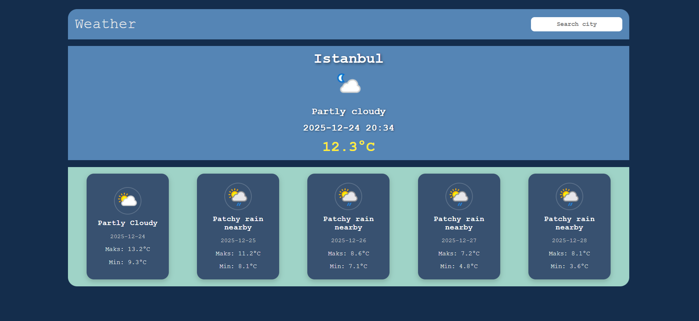

# 🌤️ WeatherNow

WeatherNow is a **real-time weather forecast application** built with **HTML, CSS, and JavaScript**, using the **WeatherAPI** to fetch live weather data.  
Users can search for any city and instantly view the current weather, temperature, date & time, and a **5-day forecast** with daily high and low temperatures.

The project emphasizes a clean and responsive design while keeping the code modular and easy to understand.

---

## 🚀 Features

- 🌆 Search weather by city
- 🌡️ Display current temperature and weather condition (e.g., Partly Cloudy, Sunny)
- 🕒 Show current date and time for the searched city
- 📅 5-day weather forecast with:
  - Max and Min temperatures
  - Weather conditions
- 🌍 Real-time data fetched from **WeatherAPI**
- 🧼 Clean, readable, and modular code structure
- 📱 Fully responsive for desktop and mobile

---

## 🧠 Application Logic

- Users type a city name in the search input
- JavaScript fetches the weather data from WeatherAPI
- Current weather and forecast are displayed dynamically
- Forecast includes:
  - Day of the week
  - Max and Min temperatures
  - Weather condition icons
---

## 🎥 Preview

  


## ⚠️ API Key Setup

Before running the project, you need to get your free API key:

1. Visit [WeatherAPI](https://www.weatherapi.com/)
2. Sign up for a free account
3. Copy your API key
4. Paste it into the `api.js` file:

```javascript
this.apiKey = "YOUR_API_KEY_HERE";
